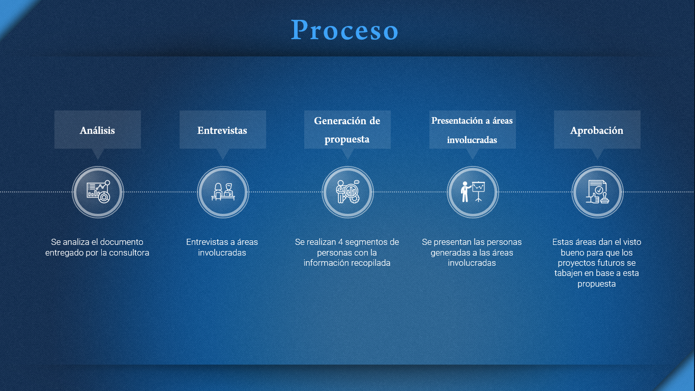
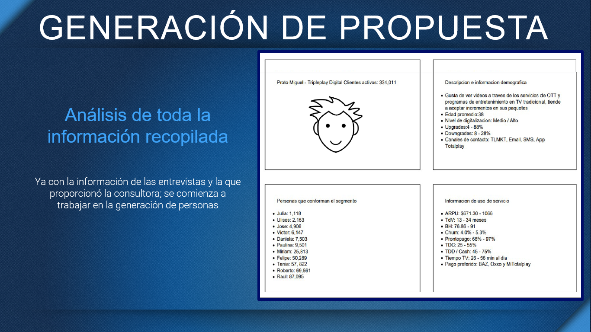
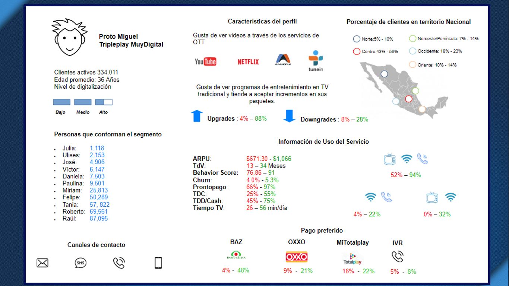
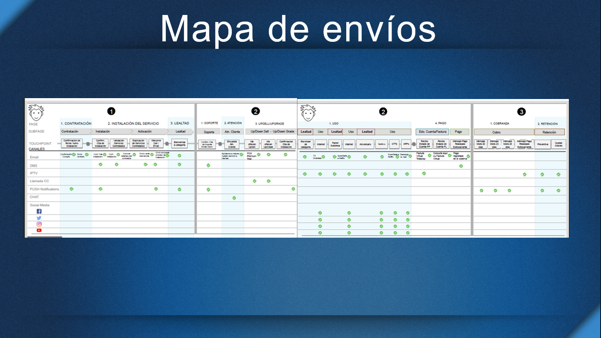

# Segmentos de usuarios para envío de comunicación efectiva

Algunas personas de diferentes áreas mostraron su preocupación por el sobreenvío de comunicación para todos los usuarios de la empresa,por lo que se decidió hacer segmentos de personas el proceso que se siguió fue:

# Análisis Inicial

Se contaba con documentación entregada por una agencia y con la cual se comenzó a trabajar esta contaba con 36 perfiles de segmentación.

# Primeras Entrevistas
Se realizaron visitas a las diferentes áreas para que dieran su punto de vista sobre los segmentos que se tenían creados y con los que ellos trabajaban.

También hablaron sobre los requerimientos que necesitaban que cubriera cada segmento y cuales envíos eran obligatorios para cada una de las áreas.

# Generación Inicial de Propuesta

# Propuesta Final por segmento

Se trabajó en varias sesiones con las áreas involucradas y por separado para que aportarán más información y que descartarán las opciones de segmentos que no les parecían importantes a sus áreas.

Al final de estas sesiones de trabajo se llego a la conclusión de trabajar con 4 segmentos de personas.

# Presentación Final a Áreas

Al haber concluido con la generación de personas se tiene una junta con todas las áreas involucradas para obtener sus impresiones finales y la aprobación para trabajar con estos perfiles para futuros proyectos.

# Mapa de envío de contenidos

Ya con la aprobación de los segmentos de usuarios, se trabajó en el mapa de envíos de contenido de cada área y siempre teniendo en cuenta que a los usuarios no les agrada recibir información diario ni repetitiva, por lo que se estableció un calendario para que cada área pudiera enviar su información sin que se obstaculizará el envió de información importante para los usuarios, con el cual se creo un mapa de envíos después de varias propuestas.

